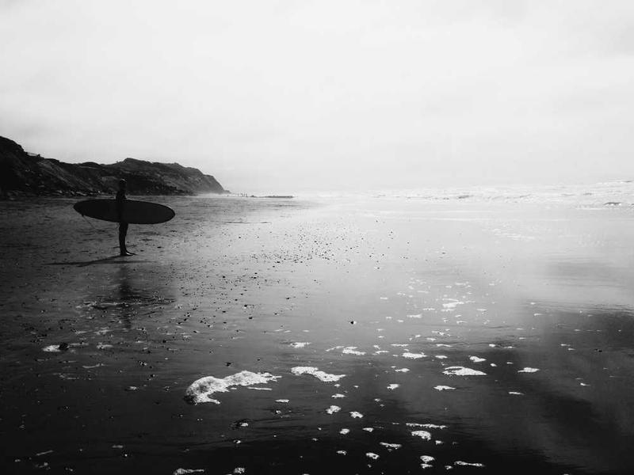

# Вопрос

Перед вами две картины одного художника:

Обе картины написаны в период, который искусствоведы называют «голубым». 

Назовите этого художника.

# Ответ

**Пабло Пикассо**

«Голубой период» Пикассо длился с 1901 по 1904 год.

# Комментарий

В этот период художник использовал холодные оттенки синего и голубого, а его работы отражали темы бедности, одиночества и человеческого страдания.

# Источник

- Джон Ричардсон, "Жизнь Пикассо", том 1
- Музей Пикассо, Барселона
